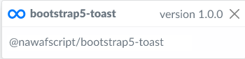
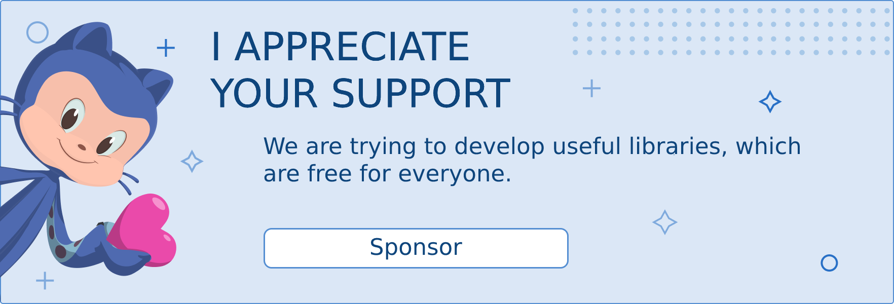

  

<h1 align="center">Toastsrap</h1>

**Toaststrap** is a javascript library for simple, lightweight toast popups. It uses bootstrap 5 styles.

[العربية](./README-ar.md)

  

## Preview

I created this library for everyone who use Bootstrap5 and want to show some beautiful notifications for his users.

## Features
- [x] Pure JavaScript without jQuery.
- [x] 🇸🇦 RTL support.
- [x] Easy to initialize and use.
- [x] 🆙 Support sound.
- [x] Quick and efficient.
- [x] 🎨 Customizable.
- [x] 🆙  Maintainable and up-to-date.
  

## Documentation

Check the [Documentation](https://nawafscript.github.io/toaststrap/) to get you started!

## Demo

Have fun with Toastsrap's [Initializer](https://nawafscript.github.io/toaststrap/Initializer/index.html)!

## Contribute
Show your ❤️ and support by giving a ⭐. Any suggestions are welcome!

## Become a sponsor

## Bugs and feature requests
Found a bug or have a feature request? [Please open a new issue](https://github.com/nawafscript/toaststrap/issues)

## License

Licensed under MIT